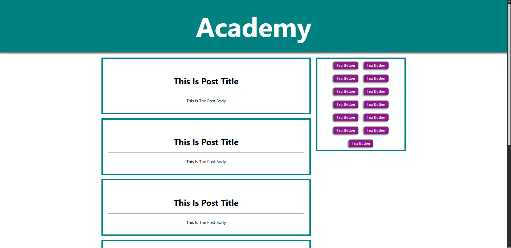

# React Components Basics

This is a simple React project built to practice the basics of components.

## 🌐 Live Demo
[Click Here](https://sherift911.github.io/React-Components-Basics/)

## 📸 Preview



## 🚀 Features

* Creating reusable components
* Structuring a simple UI
* Basic layout and styling

## 🛠️ Technologies Used

* React
* JavaScript
* CSS

## 📚 What I Learned

* How to create and use components in React
* How to organize a React project structure

## ▶️ How to Run

```bash
npm install
npm start
```

## 📌 Notes

This project is part of my React learning journey.
